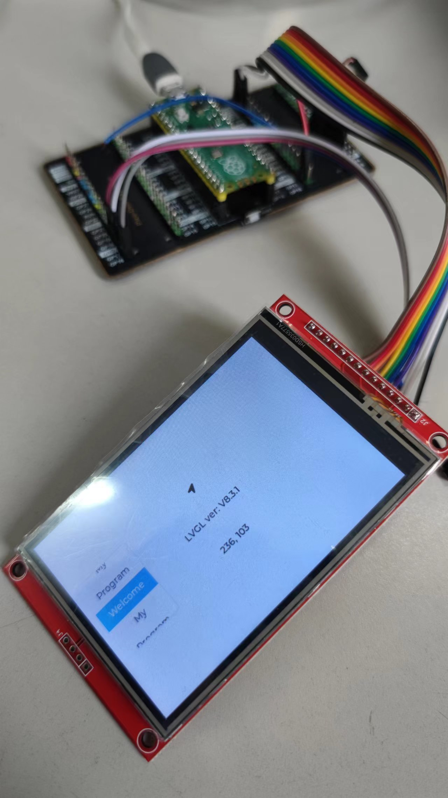
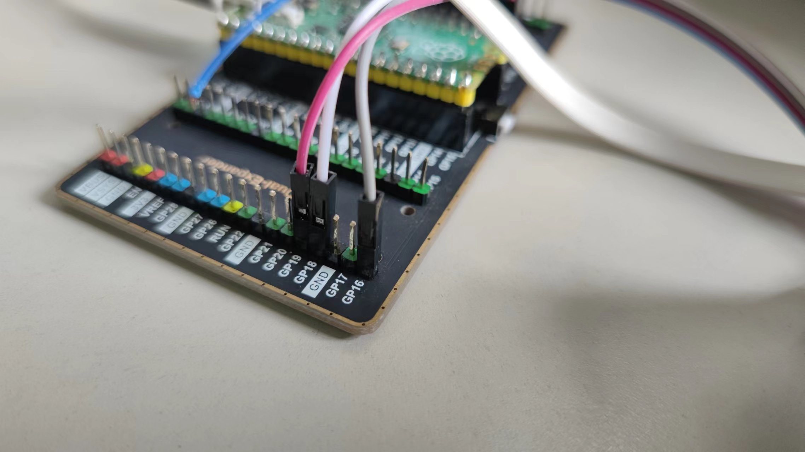

# A LVGL8 Demo based on RP2040

[Chinese 中文](./README_CN.md)

## Structure

### Hardware

* RP2040
* 3.5" TFT screen with ILI9488 [Screen more details](http://www.lcdwiki.com/3.5inch_SPI_Module_ILI9488_SKU:MSP3520)
* Resistance touch with XPT2046

[Taobao CHINA purchase link](https://item.taobao.com/item.htm?id=38842179442&_u=nlcjfo14a4). No body gives money for this ads. :)

### Software

* VS Code
* PlatformIO
* [eSPI](https://github.com/Bodmer/TFT_eSPI)
* [LVGL 8.3](https://github.com/lvgl/lvgl)
* [XPT2046 Driver](https://github.com/PaulStoffregen/XPT2046_Touchscreen)

## Performance

## Settings

### eSPI

~~~ini
; Platformio.ini

 -DILI9488_DRIVER=1
 -DTFT_WIDTH=480
 -DTFT_HEIGHT=320
 -DTFT_MOSI=11
 -DTFT_SCLK=10
 -DTFT_CS=9
 -DTFT_DC=8
 -DTFT_RST=12
~~~

As a PlatformIO project, most eSPI settings are defined on platformio.ini. Please check if you want to modify them.

**NOTE**: I use SPI channel 1 instead of channel 0, so I must write below in platformio.ini.

~~~ini
-DTFT_SPI_PORT=1
~~~

### XPT2046

Acorrding to [the author's description](https://github.com/PaulStoffregen/XPT2046_Touchscreen), we just need define CS PIN for XPT2046 driver, and others PINS are automatically defined.

~~~C
// main.cpp

#define CS_PIN 17
~~~

Then, we need connect the wires:

* TOUCH_RX GP16
* TOUCH_CS GP17(note in this picture)
* TOUCH_SCK GP18
* TOUCH_TX GP19

### Back lighting

We need set back lighting as a NONE-ZERO constant, or set int between 0 and 255. If you set nothing to it, you will see nothing display. As the demo, I set 150.

~~~C
// main.cpp

#define TFT_BL 13
uint8_t TftBackground = 150;
~~~
