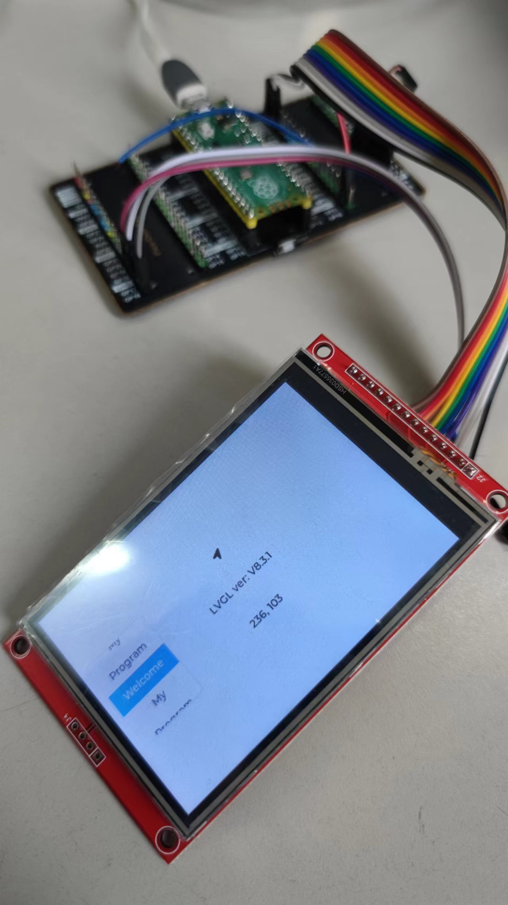

# 一款基于RP2040的LVGL8演示例程

[English 英文](./README.md)

## 接口

### 硬件

* RP2040
* 3.5寸TFT屏幕，使用ILI9488驱动 [屏幕更多信息](http://www.lcdwiki.com/zh/3.5inch_SPI_Module_ILI9488_SKU:MSP3520)
* 电阻触摸基于XPT2046

[淘宝链接](https://item.taobao.com/item.htm?id=38842179442&_u=nlcjfo14a4). 店主并未给我一毛钱的赞助 :)

### 软件

* VS Code
* PlatformIO
* [eSPI](https://github.com/Bodmer/TFT_eSPI)
* [LVGL 8.3](https://github.com/lvgl/lvgl)
* [XPT2046 Driver](https://github.com/PaulStoffregen/XPT2046_Touchscreen)

## 展示

## 设置

### eSPI

~~~ini
; Platformio.ini

 -DILI9488_DRIVER=1
 -DTFT_WIDTH=480
 -DTFT_HEIGHT=320
 -DTFT_MOSI=11
 -DTFT_SCLK=10
 -DTFT_CS=9
 -DTFT_DC=8
 -DTFT_RST=12
~~~

作为PlatfromIO的工程，大部分eSPI设置都在platformio.ini中。如果你要修改可以在这个文件中找到对应项。

**注意**: 我用SPI通道1而不是通道0，所以我必须在platformio.ini中添加如下语句：

~~~ini
-DTFT_SPI_PORT=1
~~~

### XPT2046

根据[作者描述](https://github.com/PaulStoffregen/XPT2046_Touchscreen), 我们只需定义CS PIN就可以驱动XPT2046了，而其他PINS都会被自动定义。

~~~C
// main.cpp

#define CS_PIN 17
~~~

然后，我们需要连接接线：

* TOUCH_RX GP16
* TOUCH_CS GP17(note in this picture)
* TOUCH_SCK GP18
* TOUCH_TX GP19

### 背光

我们需要给背光一个非零常量，或一个0-255的变量。如果你啥也不设置，那你啥也看不见。例程中我设置了150。

~~~C
// main.cpp

#define TFT_BL 13
uint8_t TftBackground = 150;
~~~
